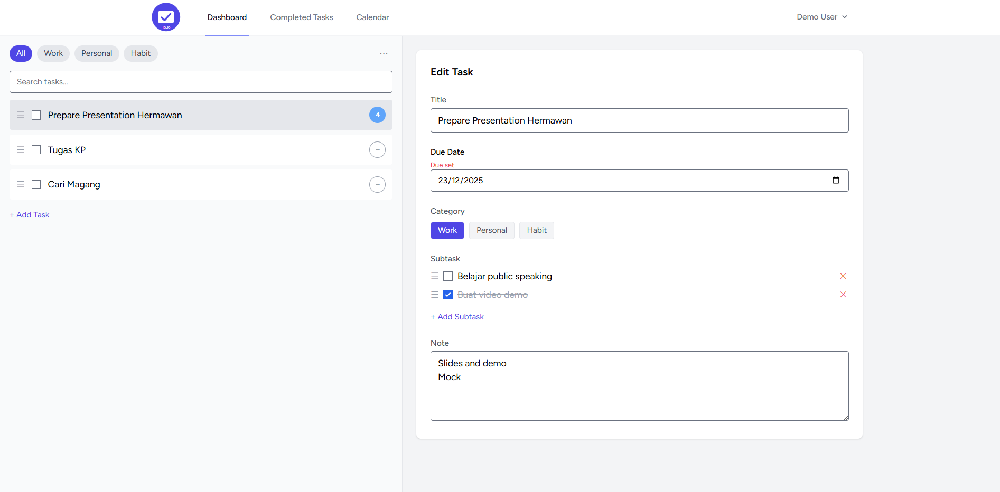
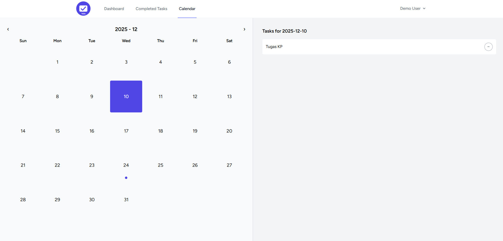
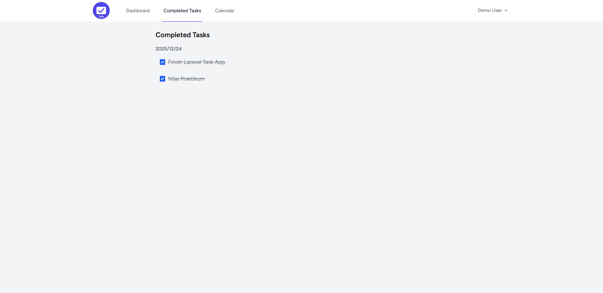
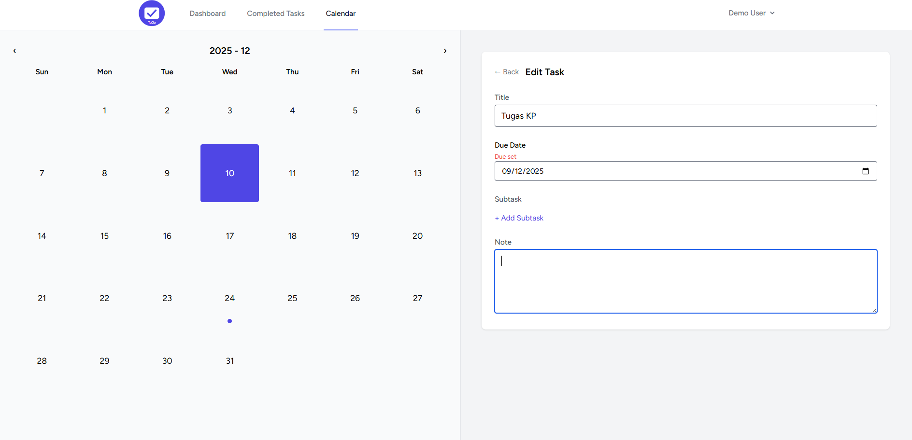
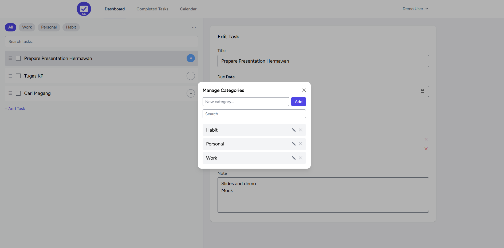
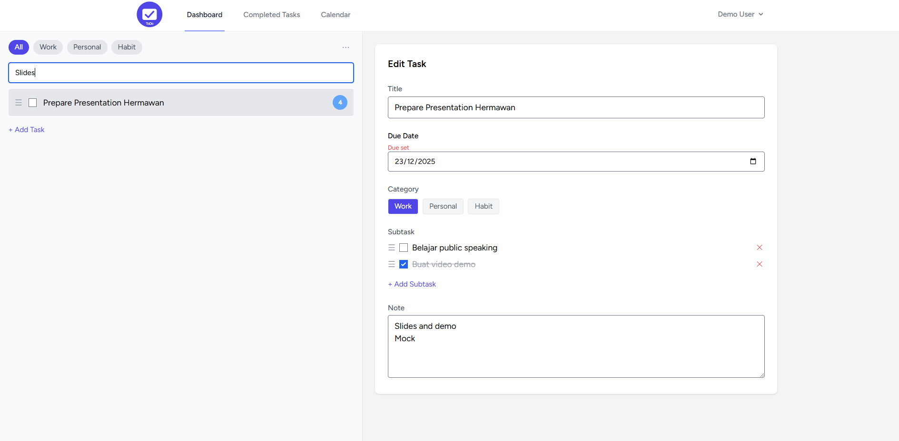
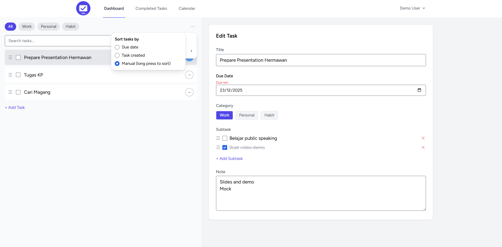

<p align="center">
  
</p>

# Table of Contents
- [Overview Aplication](#Overview-application)
- [Laravel Project – Setup & Running Guide](#Laravel-Project-–-Setup-&-Running-Guide)
- [License](#license)


# Overview application - Screenshots


Berikut adalah beberapa tampilan aplikasi:

## Dashboard Utama


## Calendar View


## Completed Task View


## Detail Task in Calendar


## Manage Categories


## Search Feature


## Sorting Task Feature



<br>
<br>
<br>
<br>
<br>
<br>

# Laravel Project – Setup & Running Guide

Dokumen ini menjelaskan langkah-langkah lengkap untuk menjalankan aplikasi Laravel dari awal (git clone) hingga aplikasi dapat berjalan di browser.

---

## Requirements

### 1. PHP
- PHP 8.2+
- Ekstensi: openssl, pdo, mbstring, tokenizer, xml, ctype, json, curl, zip

Cek versi:
```bash
php -v
```

### 2. Composer
```bash
composer -V
```

### 3. Node.js & npm
Disarankan:
- Node.js v18+
- npm v9+

Cek:
```bash
node -v
npm -v
```

### 4. Database
Gunakan salah satu:
- MySQL / MariaDB
- PostgreSQL
- SQLite


### 5. Pastikan web server (xampp, larago, etc.) dan database berjalan
---

## Installation & Setup

### 1. Clone Repository
```bash
git clone https://github.com/hanifbrian123/task-management-app.git
cd task-management-app
```

### 2. Install Dependencies via Composer
```bash
composer install
```

### 3. Copy File `.env`
```bash
cp .env.example .env
```

### 4. Generate App Key
```bash
php artisan key:generate
```

### 5. Konfigurasi Database
Edit `.env`. Atur konfigurasi database misalnya:
```
DB_CONNECTION=mysql
DB_HOST=127.0.0.1
DB_PORT=3306
DB_DATABASE=task_management
DB_USERNAME=root
DB_PASSWORD=
```

### 6. Migrasi Database
Pastikan sudah membuat database sesuai dengan konfigurasi di .env.
```bash
php artisan migrate
```

Jalankan seeder:
```bash
php artisan db:seed
```

### 7. Install Front-end Dependencies (Jika menggunakan Vite / Tailwind)
```bash
npm install
npm run build
```

Atau untuk development:
```bash
npm run dev
```

### 8. Jalankan Server Laravel
```bash
php artisan serve
```

Aplikasi dapat diakses melalui: `http://127.0.0.1:8000/login`. Untuk mendemokan aplikasi, bisa dengan login berikut:
- Username : `demo@test.com`
- Password : `password`


---


## Struktur Project (Ringkas)
```
app/Http/Controllers   → logic controller
app/Models             → model Eloquent
database/migrations    → struktur database
resources/views        → Blade templates
routes/web.php         → route web
public/                → assets publik
```

---

## Masalah Umum

### 1. Composer tidak mendeteksi PHP
Pastikan PHP ada di PATH environment.

### 2. Error timezone di log
Set timezone di `config/app.php`:
```
'timezone' => 'Asia/Jakarta'
```
Lalu:
```bash
php artisan config:clear
```

### 3. Vite error di Windows
Jalankan terpisah:
```bash
npm run dev
php artisan serve
```

---

## Ringkasan
1. Clone repo  
2. Composer install  
3. Setup `.env`  
4. Generate key  
5. Migrate DB  
6. npm install  
7. php artisan serve  

Aplikasi siap dijalankan.

---


## License

The Laravel framework is open-sourced software licensed under the [MIT license](https://opensource.org/licenses/MIT).
